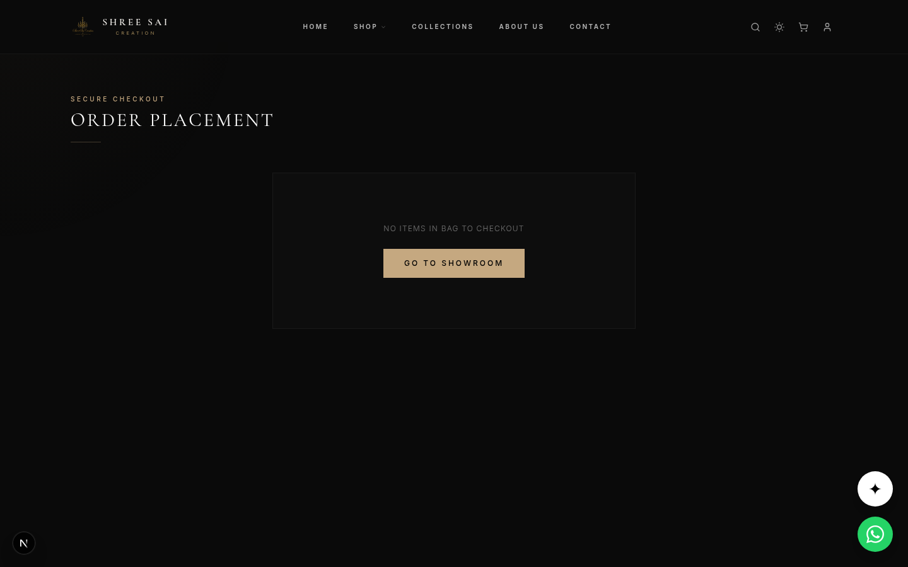

<style>
  body {
    font-family: -apple-system, BlinkMacSystemFont, "Segoe UI", Roboto, Helvetica, Arial, sans-serif;
    color: #333;
    line-height: 1.6;
    margin: 0;
    padding: 0;
  }
  h1 { color: #C5A880; border-bottom: 2px solid #C5A880; padding-bottom: 10px; margin-top: 40px; }
  h2 { color: #222; margin-top: 30px; border-bottom: 1px solid #ddd; padding-bottom: 5px; }
  h3 { color: #444; }
  pre { background: #f6f8fa; padding: 15px; border-radius: 5px; overflow-x: auto; font-size: 0.9em; }
  code { font-family: "SFMono-Regular", Consolas, "Liberation Mono", Menlo, Courier, monospace; }
  img { max-width: 100%; border: 1px solid #ddd; border-radius: 8px; margin: 15px 0; box-shadow: 0 4px 15px rgba(0,0,0,0.1); }
  .endpoint { background-color: #2b2b2b; color: #fff; padding: 8px 12px; border-radius: 4px; display: inline-block; font-weight: bold; margin-bottom: 10px; }
  .method-get { color: #61affe; }
  .method-post { color: #49cc90; }
  .method-put { color: #fca130; }
  .method-patch { color: #50e3c2; }
</style>

# Frontend-to-Backend Integration Requirements

This document outlines all integration points required between the Shree Sai Creation frontend client and the backend server. It maps out each major feature area to its corresponding UI screen, API endpoint, request methods, and expected JSON structures.

---

## 1. Authentication Module

The authentication module manages user registration and secure login via JWT tokens. The admin dashboard heavily relies on role-based authentication.


### Endpoints Required

<div class="endpoint"><span class="method-post">POST</span> /api/auth/register</div>

**Description:** Register a new user (Customer or Admin).
**Request Body:**
```json
{
  "name": "Jane Doe",
  "email": "jane@example.com",
  "password": "strongPassword123"
}
```

<div class="endpoint"><span class="method-post">POST</span> /api/auth/login</div>

**Description:** Authenticate user credentials and return a token.
**Request Body:**
```json
{
  "email": "admin@shreesaicreation.com",
  "password": "adminpassword"
}
```
**Response Body:**
```json
{
  "token": "eyJhbGciOiJIUzI1NiIsInR5cCI...",
  "user": {
    "id": "usr_123",
    "name": "Admin",
    "email": "admin@shreesaicreation.com",
    "role": "admin"
  }
}
```

---

## 2. Product Catalog & Storefront

The shop page requires dynamic product fetching, robust filtering (by category, material, finish, price), pagination, and search capabilities.


### Endpoints Required

<div class="endpoint"><span class="method-get">GET</span> /api/products</div>

**Description:** Fetch a paginated list of products. Must support query parameters for filtering and sorting.
**Query Parameters:**
- `page` (default: 1)
- `limit` (default: 12)
- `category` (e.g., "Chandelier")
- `material` (e.g., "Brass")
- `search` (e.g., "Crystal")
- `sort` (e.g., "priceAsc", "priceDesc", "rating")

**Response Body:**
```json
{
  "data": [
    {
      "id": "prod_1",
      "slug": "royal-brass-chandelier",
      "name": "Royal Brass Chandelier",
      "price": 24000,
      "discount": 10,
      "category": "Chandelier",
      "material": "Brass",
      "images": ["url1", "url2"]
    }
  ],
  "meta": {
    "currentPage": 1,
    "totalPages": 5,
    "totalItems": 60
  }
}
```

<div class="endpoint"><span class="method-get">GET</span> /api/products/:slug</div>

**Description:** Fetch complete details of a single product for the Product Detail Page (PDP).

---

## 3. Order Processing & Checkout

The checkout page needs to submit the cart contents and user details to create a formal order, integrating with a payment gateway (e.g., Razorpay/Stripe).



### Endpoints Required

<div class="endpoint"><span class="method-post">POST</span> /api/orders</div>

**Description:** Submit a new order.
**Request Body:**
```json
{
  "customer": {
    "firstName": "John",
    "lastName": "Doe",
    "email": "john@example.com",
    "address": "123 Elite Street, NY",
    "phone": "+91 9876543210"
  },
  "items": [
    {
      "productId": "prod_1",
      "quantity": 2,
      "priceAtPurchase": 21600
    }
  ],
  "totalAmount": 43200
}
```
**Response Body:**
```json
{
  "orderId": "ord_8899",
  "paymentToken": "pi_123456789",
  "status": "Pending"
}
```

---

## 4. Admin Management Dashboard

The admin panel requires secure API routes to manage the product database and track order fulfillment.


### Endpoints Required

<div class="endpoint"><span class="method-get">GET</span> /api/admin/dashboard-stats</div>

**Description:** Returns real-time metrics for the admin dashboard (Total Sales, Active Orders, Revenue).

<div class="endpoint"><span class="method-post">POST</span> /api/admin/products</div>
<div class="endpoint"><span class="method-patch">PATCH</span> /api/admin/products/:id</div>
<div class="endpoint"><span class="method-delete">DELETE</span> /api/admin/products/:id</div>

**Description:** CRUD operations for the product catalog.
*Requires `Authorization: Bearer <token>` with admin role.*

<div class="endpoint"><span class="method-patch">PATCH</span> /api/admin/orders/:id/status</div>

**Description:** Update the fulfillment status of an order.
**Request Body:**
```json
{
  "status": "Crating" // "Pending" | "Crating" | "Shipped" | "Delivered"
}
```
