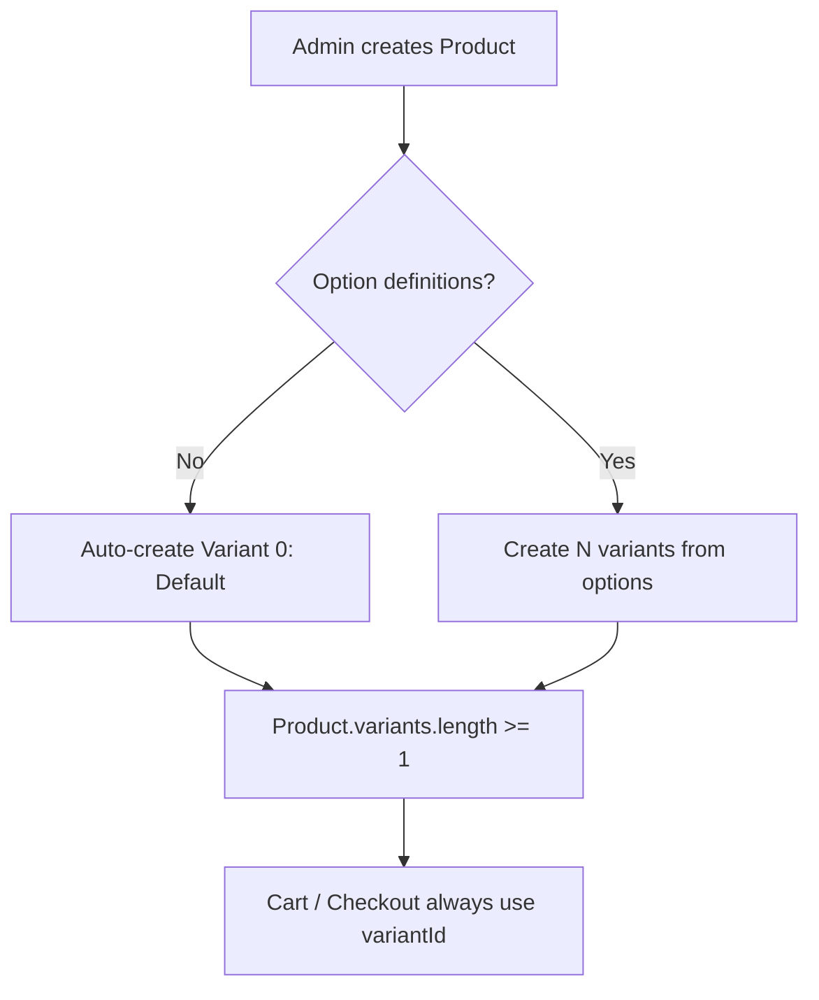
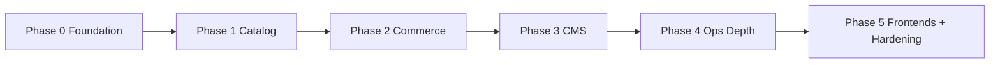

# Shree Sai Creation — Implementation Plan

> **Product:** Premium luxury lighting & chandelier e-commerce store  
> **Reference UI (inspiration only):** [shree-sai-creation.vercel.app](https://shree-sai-creation.vercel.app/)  
> **Codebase DNA:** Structure, conventions, and production discipline from **GETWAYCAB** (primary). Quality bar and admin/catalog depth inspired by **Bharat Agro Link** — without monorepo, microservices, or feature-based over-engineering.  
> **Author style:** Layered Express + MongoDB single server (`controllers → services → repositories → models`), Joi validators, JWT admin permissions, S3 uploads, Razorpay, Redis cache, Pino, Helmet.

---

## Table of Contents

1. [Product Vision](#1-product-vision)
2. [Goals & Non-Goals](#2-goals--non-goals)
3. [Tech Stack & Project Structure](#3-tech-stack--project-structure)
4. [Domain Model — Chandelier Catalog Fields](#4-domain-model--chandelier-catalog-fields)
5. [Data Models (Collections)](#5-data-models-collections)
6. [API Surface (Full E-Commerce)](#6-api-surface-full-e-commerce)
7. [Admin Panel Capabilities](#7-admin-panel-capabilities)
8. [Storefront Surfaces](#8-storefront-surfaces)
9. [Payments, Shipping, Tax, Inventory](#9-payments-shipping-tax-inventory)
10. [Background Jobs & Integrations](#10-background-jobs--integrations)
11. [Security, Observability, Ops](#11-security-observability-ops)
12. [Implementation Phases](#12-implementation-phases)
13. [File Checklist (Scaffold)](#13-file-checklist-scaffold)
14. [Testing Strategy](#14-testing-strategy)
15. [Open Questions for Review](#15-open-questions-for-review)

---

## 1. Product Vision

**Shree Sai Creation** is a single-brand, admin-driven e-commerce platform for premium lighting (chandeliers, pendants, wall lamps, linear & ceiling lights, outdoor fixtures).

Everything public-facing is CMS/admin driven:

| Area | Admin controls |
|------|----------------|
| Catalog | Categories, products, variants, images, specs, SEO |
| Merchandising | Featured, bestsellers, collections, related products |
| Storefront | Banners, home sections, trust badges, brand story, projects |
| Commerce | Prices, stock, coupons, shipping rules, tax/GST |
| Ops | Orders, returns, invoices, customers, inquiries |
| Content | FAQ, policies, contact, newsletter, WhatsApp CTA |

Default seed categories (editable, not hardcoded forever) — matching current marketing site:

1. Chandelier  
2. Indoor Wall Lamps  
3. Linear Lights  
4. Ceiling Lights  
5. Internal Pendant Lights  
6. Outdoor Wall Lamps  

---

## 2. Goals & Non-Goals

### Goals

- Production-grade e-commerce **API-first** backend (storefront + admin share same APIs).
- **Admin-driven** catalog, CMS, pricing, stock, coupons, shipping, content pages.
- Rich **lighting-specific** product attributes (not generic “product name + price” only).
- Same structural DNA as GETWAYCAB: flat `src/` layers, not feature folders, not a turborepo.
- Explicit **Repository** layer for all DB access (services never call Mongoose models directly).
- **Variant-always model:** every product has ≥1 variant; a single-SKU product is just product + default first variant (Shopify-grade pattern).
- Guest cart + authenticated cart merge, wishlist, checkout, Razorpay, order lifecycle, returns.
- GST-ready invoices, shipping zones, email/WhatsApp notifications (async via queue).
- Clean response contract via `apiResponse` utility; Joi on every write endpoint.
- Deployable as one Node process (+ optional worker process), like GETWAYCAB.

### Non-Goals (v1)

- Multi-vendor marketplace (Bharat Agro pattern) — **single store only**.
- Microservices / API gateway / pnpm workspace.
- Feature-based folder structure.
- Socket.IO realtime (not needed for v1 lighting commerce; add later only if admin live-order board is required).
- Native mobile apps (responsive web + admin web first).
- AI recommendations / complex search engines (Typesense) in v1 — Mongo text + filters first.
- International multi-currency in v1 (INR primary; currency field reserved).
- 3D configurator / AR try-on (future phase optional).

---

## 3. Tech Stack & Project Structure

### 3.1 Stack (aligned with GETWAYCAB)

| Layer | Choice | Why |
|-------|--------|-----|
| Runtime | Node.js (ESM) | Same as GETWAYCAB |
| HTTP | Express 5 | Same |
| DB | MongoDB + Mongoose 8 | Same; flexible for product specs |
| Cache | Redis (ioredis) | Session/OTP, cart guest key, home cache |
| Queue | BullMQ | Emails, invoice PDF, low-stock alerts |
| Auth | JWT + bcrypt | Customer + Admin/SubAdmin permissions |
| Validation | Joi | Same |
| Uploads | multer-s3 / AWS SDK S3 | Product gallery, banners, PDFs |
| Payments | Razorpay | Same integration discipline |
| Mail | Nodemailer | Order/invoice emails |
| PDF | PDFKit | Tax invoices |
| Logging | Pino + pino-http | Same |
| Security | Helmet, CORS, rate limit | Same bar |
| Metrics | prom-client (optional Phase 5) | Same pattern, lighter scrapes |

### 3.2 Repository layout (NOT feature-based)

```
shreesaicreation/
├── implementation.md          ← this doc
├── ARCHITECTURE.md            ← after Phase 0 (system overview)
├── package.json
├── index.js                   ← boot, middleware, mount routes
├── .env.example
├── frontend/                  ← Next.js storefront (later phases)
├── admin/                     ← Next.js / React admin (later phases)
└── src/
    ├── config/                # database, redis, bullmq, mailer, razorpay, s3, company
    ├── constants/             # order status, permissions, lighting enums
    ├── controllers/           # HTTP only: parse req, call service, return apiResponse
    ├── routes/
    ├── validators/            # Joi
    ├── services/              # business logic / orchestration (no direct Model imports)
    ├── repositories/          # ALL MongoDB access lives here
    ├── models/
    │   └── schemas/           # reusable subdocs (money, address, imageAsset, specs)
    ├── middleware/            # auth, uploads, rateLimit, errorHandler
    ├── infrastructure/        # Redis cache helpers, S3 signed URL helpers
    ├── utilities/             # apiResponse, logger, money, slug, gst, invoice
    ├── jobs/                  # cron (order auto-cancel unpaid, low stock)
    ├── workers/               # notification.worker, invoice.worker
    ├── seed/                  # admin, categories, sample products, settings
    ├── metrics/               # optional
    └── secrets/               # if needed
```

### 3.3 Layer responsibilities (Repository pattern)

| Layer | Owns | Must NOT |
|-------|------|----------|
| **Controller** | `req`/`res`, call one service method, map errors to HTTP | Business rules, DB queries |
| **Service** | Domain rules, transactions orchestration, call 1+ repositories | Import Mongoose models, know query shape |
| **Repository** | `find`, `create`, `update`, aggregations, indexes usage | HTTP, payment side-effects, email sending |
| **Model** | Schema, indexes, virtuals, document hooks | Business workflows |

**Hard rule:** `services/*` import from `repositories/*` only. Controllers never call repositories. Repositories are the only place that imports `models/*`.

Example shape:

```
src/repositories/product.repository.js   → ProductRepository
src/repositories/cart.repository.js      → CartRepository
src/repositories/order.repository.js     → OrderRepository
src/repositories/category.repository.js  → CategoryRepository
…one repository per aggregate/collection
```

Shared patterns inside repositories:

- `findById`, `findOne`, `findMany` (filters + pagination + sort)
- `create`, `updateById`, `softDeleteById`
- Domain-specific queries (`findPublishedWithFilters`, `decrementVariantStock`)
- Return lean plain objects or documents consistently (pick one convention and stick to it)

This is the same production separation used in Bharat Agro feature modules — applied here as a **flat `src/repositories/` folder** (not feature-based).

### 3.4 Request flow

```
Client → Route → Joi validator → Auth/Permission → Controller → Service → Repository → Model
                                         ↓
                                  apiResponse.success | fail
```

Heavy work (`sendEmail`, `generateInvoicePdf`, `whatsappNotify`) → BullMQ job, never block checkout response beyond payment confirmation.

### 3.5 Naming conventions

- Files: `product.model.js`, `product.controller.js`, `product.routes.js`, `product.validator.js`, `ProductService.js`, `product.repository.js`
- Classes: `ProductService`, `ProductRepository` (export default instance or class — match existing Asad style; prefer named class + default export instance)
- Response: `{ success, message, data?, meta? }` via `utilities/apiResponse.js`
- IDs: Mongo ObjectId; public codes: `SSC-ORD-YYYYMMDD-XXXX`, `SKU` strings
- Soft delete: `isDeleted` + `deletedAt` (GETWAYCAB pattern) for users/products where needed

---

## 4. Domain Model — Chandelier Catalog Fields

These fields are first-class for a lighting store. Stored as structured fields (filterable) + optional freeform `attributes[]` for future admin-defined keys.

### 4.1 Category fields

| Field | Type | Notes |
|-------|------|-------|
| `name` | string | e.g. Chandelier |
| `slug` | string unique | URL |
| `description` | string | Long HTML/markdown |
| `shortDescription` | string | Cards |
| `image` | media | Listing thumbnail |
| `bannerImage` | media | Category hero |
| `parentId` | ObjectId? | Optional nesting (e.g. Crystal → Chandelier) |
| `sortOrder` | number | Admin drag order |
| `isActive` | boolean | Soft hide |
| `isFeatured` | boolean | Home “Shop by Category” |
| `seoTitle`, `seoDescription`, `seoKeywords` | string | CMS SEO |
| `productCount` | number | Cached / derived |

### 4.2 Product fields (core commerce)

| Field | Type | Notes |
|-------|------|-------|
| `name` | string | Display name |
| `slug` | string unique | SEO URL |
| `hsnCode` | string | GST HSN for lighting (product-level default; variant may override later) |
| `categoryIds` | ObjectId[] | Primary + secondary categories |
| `collectionIds` | ObjectId[] | Admin collections (e.g. “Best Sellers”) |
| `brand` | string | Default “Shree Sai Creation” |
| `status` | enum | `draft` \| `published` \| `archived` |
| `visibility` | enum | `public` \| `hidden` \| `password` (B2B later) |
| `shortDescription` | string | |
| `description` | rich text | HTML |
| `highlights` | string[] | Bullet points |
| `tags` | string[] | Search/filter |
| `taxPercent` | number | GST % (e.g. 18) — product-level default |
| `isTaxInclusive` | boolean | Display price incl. tax |
| `optionDefinitions` | array | e.g. `[{ name: "Finish", values: ["Gold","Chrome"] }]` — empty when single-SKU |
| `hasOnlyDefaultVariant` | boolean | Derived/cached: `variants.length === 1 && isDefault` |
| `isFeatured` | boolean | |
| `isBestSeller` | boolean | |
| `isNewArrival` | boolean | |
| `isCustomOrder` | boolean | Made-to-order flag |
| `leadTimeDays` | number | For custom / out-of-stock ETA |
| `sortOrder` | number | |
| `averageRating` | number | Aggregated |
| `reviewCount` | number | |
| `soldCount` | number | Merchandising |
| `relatedProductIds` | ObjectId[] | Manual + auto later |
| `seoTitle`, `seoDescription`, `seoKeywords` | | |
| `publishedAt` | Date | |

> **Commerce money & stock do NOT live on Product as the source of truth.**  
> Price, compare-at, SKU, barcode, and inventory live on **Variant**. Product may expose denormalized `fromPrice` / `totalStock` for PLP cards only (maintained by service on variant write).

### 4.3 Lighting / chandelier specification fields (filterable)

| Field | Type | Example / Notes |
|-------|------|-----------------|
| `productType` | enum | `chandelier`, `pendant`, `wall_lamp`, `ceiling_light`, `linear`, `outdoor_wall`, `flush_mount`, `sconce`, `other` |
| `style` | enum[] | `modern`, `contemporary`, `traditional`, `classic`, `industrial`, `art_deco`, `minimal`, `luxury`, `crystal` |
| `mountType` | enum | `ceiling`, `pendant`, `flush`, `semi_flush`, `wall`, `recessed` |
| `roomTypes` | enum[] | `living`, `dining`, `bedroom`, `lobby`, `hallway`, `outdoor`, `office`, `staircase` |
| `materials` | string[] | Crystal, Brass, Glass, Iron, Wood, Acrylic… |
| `finish` | string[] | Antique Brass, Chrome, Gold, Matte Black, Rose Gold… |
| `primaryColor` | string | For filters |
| `bulbType` | enum | `led_integrated`, `e27`, `e14`, `g9`, `gu10`, `b22`, `other` |
| `bulbIncluded` | boolean | |
| `numberOfLights` | number | Arms / points |
| `maxWattage` | number | Per bulb or total |
| `totalWattage` | number | |
| `voltage` | string | `220-240V` |
| `colorTemperature` | enum[] | `warm_2700k`, `neutral_4000k`, `cool_6000k`, `tunable` |
| `lumens` | number? | Optional |
| `cri` | number? | Color rendering |
| `dimmable` | boolean | |
| `dimmerType` | string? | Triac, 0-10V, smart |
| `ipRating` | string? | IP44/IP65 for outdoor |
| `energyRating` | string? | |
| **Dimensions** | | |
| `heightCm` | number | |
| `widthCm` | number | |
| `depthCm` | number | |
| `diameterCm` | number | Common for chandeliers |
| `canopyDiameterCm` | number | Ceiling plate |
| `minDropCm` / `maxDropCm` | number | Adjustable chain/rod |
| `chainLengthCm` | number | |
| `weightKg` | number | |
| `installationType` | enum | `hardwired`, `plug_in` |
| `assemblyRequired` | boolean | |
| `certified` | string[] | ISI, CE, RoHS |
| `warrantyMonths` | number | |
| `careInstructions` | string | |
| `installationNotes` | string | |
| `customizationAvailable` | boolean | Size/finish custom |
| `customizationNotes` | string | |

### 4.4 Media

| Field | Notes |
|-------|-------|
| `images[]` | `{ url, key, alt, sortOrder, isPrimary }` |
| `lifestyleImages[]` | Room-context shots |
| `videos[]` | `{ url, thumbnail, sortOrder }` |
| `brochurePdf` | Spec sheet / PDF |
| `sizeGuideImage` | Optional |

### 4.5 Variants — always at least one (locked decision)

**Production-grade invariant (Shopify / Magento / high-grade catalogs):**

> A Product is never sold directly. Commerce always goes through a Variant.  
> If the merchant creates a “single product” with no options, the system **auto-creates the first default variant** and all cart/order/inventory APIs still reference `variantId`.

#### Why

- One code path for cart, checkout, stock, pricing, refunds — no `if (hasVariants)` forks.
- Adding a second finish/size later does not require migrating historical order lines.
- Admin UI can hide the variant picker when `hasOnlyDefaultVariant === true`, but APIs stay uniform.

#### Create-product behaviour

| Admin action | System behaviour |
|--------------|------------------|
| Create product with only base price/SKU/stock (no options) | Persist product + **exactly one** variant: `title: "Default"`, `isDefault: true`, `options: {}`, price/SKU/stock from payload |
| Create product with option definitions (Finish, Size, …) | Create N variants from combinations (or admin-supplied list); **exactly one** has `isDefault: true` |
| Delete variants | Hard-block if it would leave `variants.length === 0` |
| Delete “the only” variant | Not allowed — archive product instead, or replace via update |

#### Variant fields

| Field | Notes |
|-------|-------|
| `_id` | Always present; used by cart/order lines |
| `title` / `variantName` | `"Default"` for single-SKU; else `"Gold / 8 Lights"` |
| `sku` | Unique globally |
| `barcode` | Optional |
| `options` | Map of optionName → value; `{}` for default-only |
| `priceInPaise` | Selling price (source of truth) |
| `compareAtPriceInPaise` | MRP / strike |
| `costPriceInPaise` | Admin-only margin |
| `stock` | Per-variant inventory |
| `trackInventory` | boolean |
| `allowBackorder` | boolean |
| `lowStockThreshold` | number |
| `images[]` | Variant-specific (optional; fall back to product gallery) |
| `dimensions` | Override height/diameter when size differs |
| `weightKg` | Shipping |
| `package*` | Package dims override |
| `isDefault` | Exactly one `true` per product |
| `isActive` | Soft-hide a SKU without deleting |
| `position` | Sort order |

#### Commerce rules (non-negotiable)

- Cart line, order line, wishlist (optional), inventory adjust → **require `variantId`**.
- Never accept `productId` alone for add-to-cart.
- Inventory decremented on **paid** order (or reserved on create — see §15) **per variant**.
- Public PDP: if `hasOnlyDefaultVariant`, storefront skips option UI and uses the default `variantId` under the hood.



Storage: **embedded `variants[]` on Product** (sufficient for this catalog size). Separate `ProductVariant` collection only if we ever exceed large SKU scale — interface via `ProductRepository` so swap is local.

### 4.6 Collections (merchandising)

Admin-created curated groups: Best Sellers, New Arrivals, Crystal Edit, Outdoor Essentials.

Fields: `name`, `slug`, `description`, `image`, `productIds[]` or rule-based filters, `isActive`, `sortOrder`, SEO.

### 4.7 Shipping package dims (per product/variant)

| Field | Notes |
|-------|-------|
| `packageLengthCm`, `packageWidthCm`, `packageHeightCm` | Courier |
| `packageWeightKg` | |
| `fragile` | boolean — packing notes |
| `shipsSeparately` | boolean |

---

## 5. Data Models (Collections)

| Model | Purpose |
|-------|---------|
| `Admin` | Admin / SubAdmin + `permissions[]` |
| `User` | Customer account |
| `Address` | Shipping/billing addresses |
| `Category` | Tree-capable categories |
| `Collection` | Merchandising collections |
| `Product` | Catalog + lighting specs + **embedded `variants[]` (length ≥ 1 always)** |
| `Product.variants[]` | Never empty; single-SKU = one default variant |
| `Cart` | Guest token or `userId` |
| `Wishlist` | Per user |
| `Coupon` / `PromoCode` | Discounts |
| `Order` | Order header + line items + status timeline |
| `Payment` | Razorpay order/payment/refund records |
| `Shipment` | Courier AWBs (Phase 4) |
| `ReturnRequest` | RMA flow |
| `Review` | Product reviews + moderation |
| `Banner` | Hero / promo banners |
| `HomeSection` | Admin-ordered home layout blocks |
| `Page` | CMS pages (About, Shipping Policy, Privacy, Terms, Returns) |
| `Faq` / `FaqCategory` | Help center |
| `Inquiry` / `Contact` | Custom design inquiry + contact form |
| `NewsletterSubscriber` | Email list |
| `Notification` | In-app/admin feed (optional) |
| `MediaAsset` | Optional media library index |
| `StoreSettings` | Singleton: GSTIN, addresses, shipping defaults, WhatsApp, socials |
| `ShippingZone` | Pin / state based rates |
| `AuditLog` | Admin mutation trail for orders/products (lightweight) |

### 5.1 Order status machine (v1)

```
pending_payment → paid → processing → packed → shipped → delivered → completed
       ↓            ↓         ↓
    cancelled    refunded  on_hold
                              ↓
                         return_requested → return_approved → refunded
```

Every transition stored in `statusHistory[]`: `{ status, at, by, note }`.

### 5.2 Money representation

**Recommendation:** store amounts as **integer paise** (`priceInPaise`) like fintech ledger discipline from GETWAYCAB wallet work — avoids float bugs. API can serialize to rupees for UI.

---

## 6. API Surface (Full E-Commerce)

Base prefix: `/api/v1`

Auth header: `Authorization: Bearer <token>`  
Admin permissions checked via `authJwt.hasPermission('<Module>')`.

### 6.1 Auth — Customer

| Method | Path | Auth | Description |
|--------|------|------|-------------|
| POST | `/auth/register` | Public | Email/phone + password or OTP |
| POST | `/auth/login` | Public | |
| POST | `/auth/otp/send` | Public | Phone/email OTP |
| POST | `/auth/otp/verify` | Public | Issue JWT |
| POST | `/auth/forgot-password` | Public | |
| POST | `/auth/reset-password` | Public | |
| POST | `/auth/refresh` | Public | Refresh token rotation |
| POST | `/auth/logout` | User | Invalidate refresh |
| GET | `/auth/me` | User | Profile |
| PATCH | `/auth/me` | User | Update profile |
| DELETE | `/auth/me` | User | Soft delete / request deletion |

### 6.2 Auth — Admin

| Method | Path | Auth | Description |
|--------|------|------|-------------|
| POST | `/admin/auth/login` | Public | |
| POST | `/admin/auth/refresh` | Public | |
| POST | `/admin/auth/logout` | Admin | |
| GET | `/admin/auth/me` | Admin | |
| CRUD | `/admin/subadmins` | Admin + `SubAdmins` | Permissioned staff |

**Admin permission modules (proposed):**

`Dashboard`, `Categories`, `Products`, `Collections`, `Orders`, `Customers`, `Coupons`, `Reviews`, `Banners`, `HomeSections`, `Pages`, `Faqs`, `Inquiries`, `Shipping`, `Settings`, `Media`, `Reports`, `SubAdmins`, `Returns`, `Newsletter`

### 6.3 Categories

| Method | Path | Auth | Description |
|--------|------|------|-------------|
| GET | `/categories` | Public | Active tree/list |
| GET | `/categories/:slug` | Public | Detail + product count |
| GET | `/admin/categories` | Admin | All incl. inactive |
| POST | `/admin/categories` | Admin | Create |
| PATCH | `/admin/categories/:id` | Admin | Update |
| PATCH | `/admin/categories/reorder` | Admin | Bulk sort |
| DELETE | `/admin/categories/:id` | Admin | Soft delete / block if products |

### 6.4 Collections

Same public/admin pattern as categories (`/collections`, `/admin/collections`).

### 6.5 Products (Catalog)

| Method | Path | Auth | Description |
|--------|------|------|-------------|
| GET | `/products` | Public | List + filters + pagination + sort |
| GET | `/products/:slug` | Public | PDP (variants, related, reviews summary) |
| GET | `/products/filters` | Public | Facets for current query |
| GET | `/products/search?q=` | Public | Text search |
| GET | `/admin/products` | Admin | Full list + draft/archived |
| POST | `/admin/products` | Admin | Create |
| GET | `/admin/products/:id` | Admin | |
| PATCH | `/admin/products/:id` | Admin | Update |
| PATCH | `/admin/products/:id/status` | Admin | publish/archive |
| DELETE | `/admin/products/:id` | Admin | Soft delete |
| POST | `/admin/products/:id/variants` | Admin | Add variant |
| PATCH | `/admin/products/:id/variants/:vid` | Admin | |
| DELETE | `/admin/products/:id/variants/:vid` | Admin | |
| POST | `/admin/products/:id/media` | Admin | Attach images |
| PATCH | `/admin/products/bulk` | Admin | Bulk status/price/category |
| GET | `/admin/products/export` | Admin | CSV/Excel |
| POST | `/admin/products/import` | Admin | CSV import (Phase 4) |

**Public filter query params (examples):**

`category`, `collection`, `style`, `finish`, `material`, `roomType`, `mountType`, `minPrice`, `maxPrice`, `numberOfLights`, `dimmable`, `ipRating`, `isFeatured`, `isBestSeller`, `inStock`, `sort=price_asc|price_desc|newest|popular|rating`

### 6.6 Media / Upload

| Method | Path | Auth | Description |
|--------|------|------|-------------|
| POST | `/upload` | Admin | Single/multi to S3 |
| POST | `/upload/presign` | Admin | Optional client direct upload |
| DELETE | `/upload` | Admin | Delete by key |

### 6.7 Cart

| Method | Path | Auth | Description |
|--------|------|------|-------------|
| GET | `/cart` | Guest/User | Header `x-guest-token` or JWT |
| POST | `/cart/items` | Guest/User | Add variant + qty |
| PATCH | `/cart/items/:itemId` | Guest/User | Update qty |
| DELETE | `/cart/items/:itemId` | Guest/User | Remove |
| DELETE | `/cart` | Guest/User | Clear |
| POST | `/cart/merge` | User | Merge guest → user after login |
| POST | `/cart/coupon` | Guest/User | Apply coupon |
| DELETE | `/cart/coupon` | Guest/User | Remove coupon |
| GET | `/cart/summary` | Guest/User | Totals: subtotal, discount, tax, shipping, grand |

### 6.8 Wishlist

| Method | Path | Auth | Description |
|--------|------|------|-------------|
| GET | `/wishlist` | User | |
| POST | `/wishlist/:productId` | User | Add |
| DELETE | `/wishlist/:productId` | User | Remove |
| POST | `/wishlist/move-to-cart` | User | |

### 6.9 Addresses

| Method | Path | Auth | Description |
|--------|------|------|-------------|
| GET | `/addresses` | User | |
| POST | `/addresses` | User | |
| PATCH | `/addresses/:id` | User | |
| DELETE | `/addresses/:id` | User | |
| PATCH | `/addresses/:id/default` | User | |

### 6.10 Checkout & Orders (Customer)

| Method | Path | Auth | Description |
|--------|------|------|-------------|
| POST | `/checkout/preview` | Guest/User | Validate cart, shipping, coupon, totals |
| POST | `/checkout/create-order` | Guest/User | Create `pending_payment` order + Razorpay order |
| POST | `/checkout/confirm` | Guest/User | Client confirm after payment (idempotent; webhook is source of truth) |
| GET | `/orders` | User | My orders |
| GET | `/orders/:orderNumber` | User | Detail + timeline |
| POST | `/orders/:orderNumber/cancel` | User | If allowed |
| GET | `/orders/:orderNumber/invoice` | User | PDF download |
| POST | `/orders/:orderNumber/return` | User | Return request |

Guest checkout: email + phone + shipping address required; optional account creation.

### 6.11 Payments & Webhooks

| Method | Path | Auth | Description |
|--------|------|------|-------------|
| POST | `/webhooks/razorpay` | Signature | Payment authorized/captured/failed/refund |
| GET | `/payments/:paymentId` | Admin/User | Status |

### 6.12 Coupons

| Method | Path | Auth | Description |
|--------|------|------|-------------|
| POST | `/coupons/validate` | Guest/User | Preview discount |
| CRUD | `/admin/coupons` | Admin | Full CRUD |

Coupon capabilities: % or flat, min cart, max discount, usage limit global/per user, start/end, category/product restrictions, first-order-only, free shipping flag.

### 6.13 Shipping

| Method | Path | Auth | Description |
|--------|------|------|-------------|
| POST | `/shipping/quote` | Public | Address + cart → rates |
| CRUD | `/admin/shipping/zones` | Admin | Zones & rates |
| CRUD | `/admin/shipping/methods` | Admin | Standard / Express / Free threshold |

### 6.14 Reviews

| Method | Path | Auth | Description |
|--------|------|------|-------------|
| GET | `/products/:slug/reviews` | Public | Approved only |
| POST | `/products/:slug/reviews` | User | Verified purchase optional |
| GET | `/admin/reviews` | Admin | Moderation queue |
| PATCH | `/admin/reviews/:id` | Admin | Approve/reject |

### 6.15 CMS / Home / Content

| Method | Path | Auth | Description |
|--------|------|------|-------------|
| GET | `/home` | Public | Assembled home payload (cached) |
| CRUD | `/admin/banners` | Admin | |
| CRUD | `/admin/home-sections` | Admin | Section types below |
| GET | `/pages/:slug` | Public | Policy/about |
| CRUD | `/admin/pages` | Admin | |
| GET | `/faqs` | Public | |
| CRUD | `/admin/faqs` | Admin | |
| GET | `/store/settings` | Public | Non-secret settings (WhatsApp, social, support hours) |
| PATCH | `/admin/settings` | Admin | Full settings |

**Home section types (v1):**

`hero_banner`, `category_grid`, `product_rail`, `product_grid`, `trust_badges`, `feature_blocks`, `cta_banner`, `projects_gallery`, `newsletter`, `custom_html`

Inspired by Bharat Agro home engine — **simplified**, single store, no region targeting in v1.

### 6.16 Inquiries / Contact / Newsletter

| Method | Path | Auth | Description |
|--------|------|------|-------------|
| POST | `/contact` | Public | Contact form |
| POST | `/inquiries` | Public | Custom chandelier design inquiry |
| GET | `/admin/inquiries` | Admin | |
| PATCH | `/admin/inquiries/:id` | Admin | Status notes |
| POST | `/newsletter/subscribe` | Public | |
| POST | `/newsletter/unsubscribe` | Public | |
| GET | `/admin/newsletter` | Admin | Export |

### 6.17 Customers (Admin)

| Method | Path | Auth | Description |
|--------|------|------|-------------|
| GET | `/admin/customers` | Admin | Search/list |
| GET | `/admin/customers/:id` | Admin | Profile + orders |
| PATCH | `/admin/customers/:id` | Admin | Disable/enable |
| GET | `/admin/customers/:id/orders` | Admin | |

### 6.18 Orders (Admin)

| Method | Path | Auth | Description |
|--------|------|------|-------------|
| GET | `/admin/orders` | Admin | Filters by status/date/payment |
| GET | `/admin/orders/:id` | Admin | Full detail |
| PATCH | `/admin/orders/:id/status` | Admin | Transition + note |
| POST | `/admin/orders/:id/refund` | Admin | Razorpay refund |
| POST | `/admin/orders/:id/shipment` | Admin | Add tracking |
| GET | `/admin/orders/export` | Admin | |
| GET | `/admin/orders/:id/invoice` | Admin | Regenerate/download |

### 6.19 Returns (Admin + Customer) — deferred

> **Not in Phase 4.** Return/RMA APIs will be added later on request.

### 6.20 Dashboard & Reports (Admin)

| Method | Path | Auth | Description |
|--------|------|------|-------------|
| GET | `/admin/dashboard` | Admin | KPIs: sales, orders, AOV, low stock |
| GET | `/admin/reports/sales` | Admin | Date range |
| GET | `/admin/reports/products` | Admin | Top sellers |
| GET | `/admin/reports/inventory` | Admin | Low/out of stock |

### 6.21 Health

| Method | Path | Auth | Description |
|--------|------|------|-------------|
| GET | `/health` | Public | DB + Redis ping |
| GET | `/metrics` | Locked | Prometheus (optional) |

---

## 7. Admin Panel Capabilities

Production admin must cover:

1. **Catalog** — categories (tree + reorder), products with full lighting specs, variants, media, SEO preview  
2. **Inventory** — stock adjust with reason log, low-stock list  
3. **Orders** — lifecycle, print invoice, tracking, refunds, notes  
4. **Customers** — profiles, disable, order history  
5. **Marketing** — coupons, banners, home sections, collections, newsletter  
6. **Content** — pages, FAQs, brand story, projects gallery  
7. **Inquiries** — custom design leads (high value for chandelier brand)  
8. **Settings** — GSTIN, bank/UPI display, shipping rules, WhatsApp number, store address  
9. **Staff** — SubAdmins with fine-grained permissions  
10. **Reports** — sales & inventory  

UI stack later: Next.js + same design discipline as your other frontends — **not** bound to the current Vercel marketing look.

---

## 8. Storefront Surfaces

Public pages (API-backed):

| Page | Data source |
|------|-------------|
| Home | `/home` |
| Shop / PLP | `/products` + filters |
| Category | `/categories/:slug` + products |
| Collection | `/collections/:slug` |
| PDP | `/products/:slug` |
| Cart / Checkout | cart + checkout APIs |
| Account | orders, addresses, wishlist, profile |
| About / Policies | `/pages/:slug` |
| Contact / Custom inquiry | forms |
| Track order | order number + email (guest) or auth |
| Search | `/products/search` |

WhatsApp chat CTA: driven by `StoreSettings.whatsappNumber` (site already has this pattern).

---

## 9. Payments, Shipping, Tax, Inventory

### Payments

- Create Razorpay order on checkout.
- **Webhook is source of truth** for `paid` (GETWAYCAB discipline).
- Idempotent handlers keyed by `razorpay_payment_id` / event id.
- Support: full refund, partial refund (admin).

### Tax (GST India)

- Per-line: taxable value, CGST/SGST or IGST based on ship-to state vs store state.
- Store `StoreSettings.gstin`, `stateCode`.
- Invoice PDF with HSN per line.

### Shipping

- Free shipping above threshold (admin setting) — matches marketing claim, but **configurable**.
- Else flat / weight / zone-based pin-prefix rules.
- COD optional Phase 4 (if enabled: extra fee + order status nuances).

### Inventory

- Stock lives **only on variants** (including the auto-created default variant).
- Atomic stock decrement with `findOneAndUpdate` on `variants.$` / arrayFilters where `stock >= qty`.
- On cancel/refund before ship → restock that `variantId`.
- Low stock → BullMQ notify admin email.
- Never maintain a parallel product-level stock counter as source of truth (optional denormalized `totalStock` for admin lists only).

---

## 10. Background Jobs & Integrations

| Job | Trigger | Action |
|-----|---------|--------|
| `email.order.placed` | payment success | Customer email |
| `email.order.shipped` | status change | Tracking email |
| `invoice.generate` | payment success | PDF → S3 → attach |
| `admin.low_stock` | stock threshold | Alert |
| `order.cancel_unpaid` | cron | Expire pending_payment after N minutes |
| `newsletter` | manual/cron | Optional campaigns later |

Integrations v1: Razorpay, S3/Linode Object Storage, SMTP, optional WhatsApp Business API / deep-link `wa.me`.

---

## 11. Security, Observability, Ops

- Helmet, CORS allowlist (not `*` in production), rate limits on auth/OTP/checkout.
- Joi validation on all writes; sanitize HTML in product descriptions.
- Admin mutations audited for orders, refunds, stock adjusts.
- Pino structured logs; never log card/PAN data.
- `.env` secrets; no secrets in repo.
- Soft indexes: product slug, sku, category slug, orderNumber unique.
- Redis cache for `/home` with version bump on admin CMS save.

---

## 12. Implementation Phases

### Phase 0 — Foundation (review-approved, then code)

**Deliverables**

- Repo scaffold mirroring GETWAYCAB `src/` layout **plus `src/repositories/`**  
- `package.json`, ESM, `index.js` boot  
- `config/database.js`, `config/redis.js`, `utilities/apiResponse.js`, `utilities/logger.js`  
- `middleware/auth.js` (User + Admin + `hasPermission`)  
- Example `AdminRepository` + `AdminService` pattern established as template for all modules  
- `Admin` model + seed superadmin  
- `StoreSettings` model + seed  
- Health route, Helmet, CORS, pino-http  
- `.env.example`, README  

**Exit criteria:** Server boots, Mongo + Redis connect, admin login returns JWT; layering convention documented in code (one sample module with repository).

---

### Phase 1 — Catalog Core (Admin-driven)

**Deliverables**

- Categories CRUD + public list/tree  
- Products CRUD with **full lighting spec fields**  
- **Always-create-default-variant** on product create; block empty variants  
- Variants CRUD + media upload (S3)  
- `ProductRepository` + `CategoryRepository` + `CollectionRepository`  
- Collections CRUD  
- Public PLP/PDP APIs with filters/sort/pagination (`fromPrice` from default/min variant)  
- SEO fields on category/product  
- Seed categories from current site list  

**Exit criteria:** Admin can create category → product (auto default variant) → extra variants → images; public APIs return filterable catalog; no product exists with `variants.length === 0`.

---

### Phase 2 — Cart, Checkout, Payments, Orders

**Deliverables**

- User auth (register/login/OTP as chosen)  
- Addresses  
- Cart (guest + merge) — lines always keyed by `variantId`  
- Coupon validate/apply  
- Shipping quote (basic free-threshold + flat)  
- Checkout create + Razorpay + webhook  
- Order list/detail/cancel (rules) — line items snapshot product + variant  
- Inventory decrement on paid **per variant**  
- Invoice PDF generation job  
- Admin order list + status transitions + refund  

**Exit criteria:** End-to-end purchase works in test mode; webhook marks paid; stock reduces; invoice generated.  
Single-SKU products check out using their auto-created default `variantId` with no special-case client code.

---

### Phase 3 — CMS, Merchandising, Storefront Content

**Deliverables**

- Banners, HomeSections, `/home` assembler + Redis cache  
- CMS Pages (About, Shipping, Returns, Privacy, Terms)  
- FAQ module  
- Contact + Custom Design Inquiry  
- Newsletter subscribe  
- Wishlist  
- Public store settings (WhatsApp, social)  

**Exit criteria:** Home page fully admin-configurable without code deploy; inquiries land in admin.

---

### Phase 4 — Reviews, Shipping Depth, Notifications

**Deliverables**

- Reviews + moderation  
- ~~Return/RMA flow~~ — **deferred** (add later on request)  
- Shipping zones / pin-based rates  
- Shipment tracking fields + customer email on ship  
- Email notification suite (placed, shipped, delivered, refund)  
- Product CSV import/export  
- Related products (manual)  
- Abandoned cart email (optional stretch)  

**Exit criteria:** Post-purchase ops (minus returns) operable by admin without DB hacks.

---

### Phase 5 — Admin UX, Analytics, Hardening, Frontend Apps

**Deliverables**

- Dashboard KPIs + sales/inventory reports  
- Rate limiting, lock metrics endpoint  
- Prometheus metrics (optional, GETWAYCAB-lite)  
- ARCHITECTURE.md  
- Postman collection (full)  
- **Storefront frontend** (Next.js) — production design (not clone of current Vercel template)  
- **Admin frontend** — catalog/orders/CMS  
- Production deploy (Vercel FE + Node BE host)  
- Load/smoke tests on checkout path  

**Exit criteria:** Production-ready brand site + admin; monitoring + docs complete.

---

### Phase map (visual)



**Suggested sequencing rule:** Do not start frontend until Phase 2 APIs are stable; CMS Phase 3 can overlap early storefront shell.

---

## 13. File Checklist (Scaffold)

Minimal files to create in Phase 0–1:

```
index.js
package.json
src/config/database.js
src/config/redis.js
src/config/bullmq.js
src/config/mailer.js
src/config/s3.js
src/config/razorpay.js
src/config/company.js
src/utilities/apiResponse.js
src/utilities/logger.js
src/utilities/money.js
src/utilities/slugify.js
src/middleware/auth.js
src/middleware/uploads.js
src/middleware/errorHandler.js
src/models/admin.model.js
src/models/user.model.js
src/models/category.model.js
src/models/product.model.js
src/models/schemas/variant.schema.js
src/models/collection.model.js
src/models/cart.model.js
src/models/order.model.js
src/models/coupon.model.js
src/models/storeSettings.model.js
src/repositories/admin.repository.js
src/repositories/user.repository.js
src/repositories/category.repository.js
src/repositories/product.repository.js
src/repositories/collection.repository.js
src/repositories/cart.repository.js
src/repositories/order.repository.js
src/repositories/coupon.repository.js
src/repositories/storeSettings.repository.js
src/constants/permissions.constants.js
src/constants/orderStatus.constants.js
src/constants/lighting.constants.js
src/seed/admin.seed.js
src/seed/category.seed.js
```

(Routes/controllers/validators/**services**/repositories expanded per module as phases progress.)  
Services call repositories only; repositories are the sole Model importers.

---

## 14. Testing Strategy

| Level | Scope |
|-------|-------|
| Unit | Money/tax/shipping quote, coupon engine, stock atomic update |
| Integration | Checkout + webhook idempotency, cart merge |
| API | Postman/Newman collection per phase |
| Manual | Admin create product → buy → refund → restock |

Critical invariants:

1. Webhook replay must not double-decrement stock.  
2. Coupon cannot exceed usage limits under concurrency.  
3. Guest cart merge must not duplicate line items incorrectly.  
4. Unpublished products never appear on public APIs.  
5. **Every product always has `variants.length >= 1`**; create without options still yields default variant.  
6. **Cart/checkout reject lines without `variantId`.**  
7. Services never import models; only repositories do.

---

## 15. Open Questions for Review

Please decide before / during Phase 0:

1. **Auth method for customers:** Email+password, phone OTP only, or both?  
2. **Guest checkout:** Required for v1 or login-required? (Plan assumes guest allowed.)  
3. **Inventory reservation:** Decrement on `paid` only, or soft-reserve on `pending_payment`?  
4. **COD:** Needed in v1 or Phase 4?  
5. **Frontend:** Next.js App Router for both storefront + admin in one monorepo folder, or separate `frontend/` + `admin/`?  
6. **Custom orders:** Full quote workflow in inquiries only, or configurable products with “Request Quote” instead of Buy?  
7. **Multi-language:** English only for v1?  
8. **Hosting:** Same pattern as your other Node apps (VPS/PM2) + Vercel for FE?  

### Locked decisions (from review)

| Topic | Decision |
|-------|----------|
| Folder structure | Flat layered + **`src/repositories/`** (not feature-based) |
| Data access | Controller → Service → **Repository** → Model |
| Variants | **Always ≥1**; single product = auto first default variant; commerce always uses `variantId` |
| Variant storage | Embedded `variants[]` on Product (v1) |

---

## Review Checklist

Mark after reading:

- [ ] Stack & structure (GETWAYCAB-like + repositories) approved  
- [ ] Always-default-variant model approved  
- [ ] Lighting product fields sufficient / add-remove list  
- [ ] API surface complete for v1 (call out cuts)  
- [ ] Phase boundaries & order approved  
- [ ] Remaining open questions answered  

---

**Next step after your review:** Lock remaining open questions → implement **Phase 0** scaffold in this repo, then Phase 1 catalog models/APIs.
